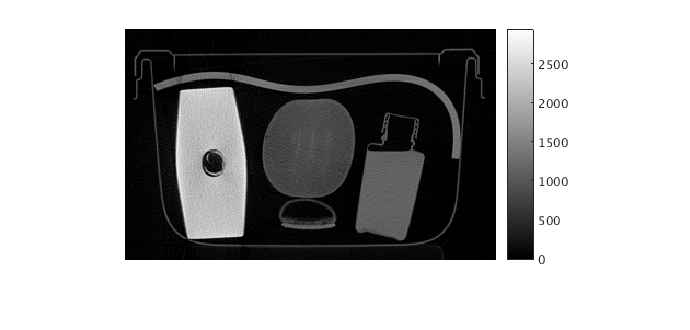
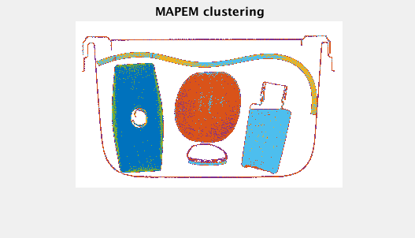

# ImageSegmentation
# This code is for demonstration of 2D CT image segmentation. And it could be futher optimized and esaier to extended to 3D CT image segmentation. 
======

======
The MAPEM MAF segmentation process:

======
The regular EM MRF segmentation process: (for comparison)

